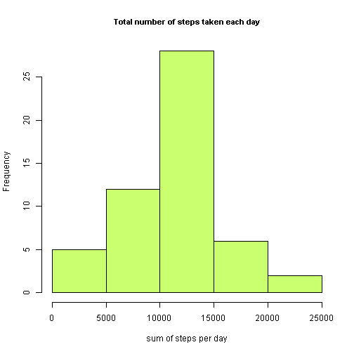
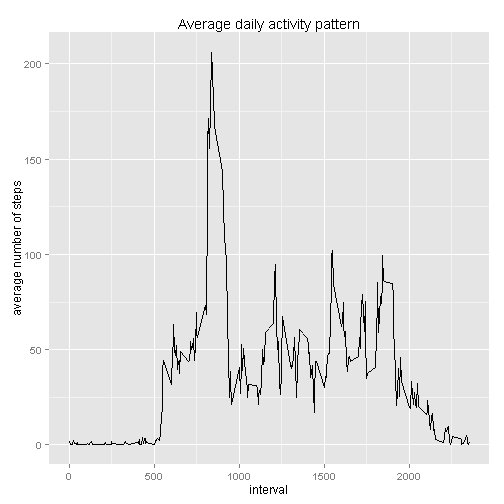
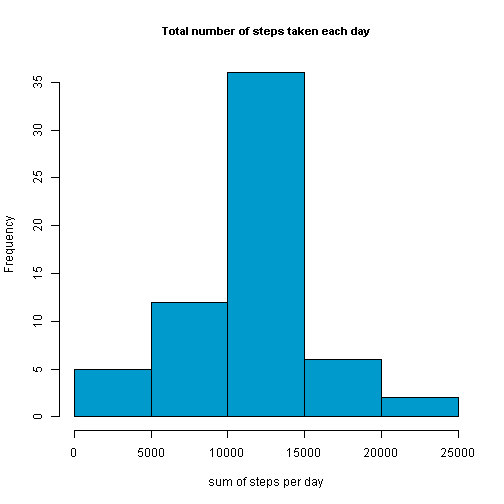
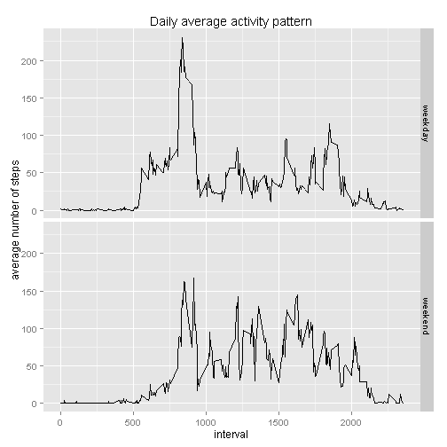

# Reproducible Research: Peer Assessment 1


## Introduction
This assignment makes use of data from a personal activity monitoring device. This device collects data at 5 minute intervals through out the day. The data consists of two months of data from an anonymous individual collected during the months of October and November, 2012 and include the number of steps taken in 5 minute intervals each day.

## Data
The data for this assignment contains Activity monitoring data. The dataset is stored in a comma-separated-value (CSV) file and there are a total of 17,568 observations in this dataset.


The variables included in this dataset are:
    - steps: Number of steps taking in a 5-minute interval (missing values are coded as NA)
    - date: The date on which the measurement was taken in YYYY-MM-DD format
    - interval: Identifier for the 5-minute interval in which measurement was taken


## Loading and preprocessing the data
The dataset is read into DataFrame dfDevice using the code below.

```r
    setwd("C:/Users/Gebruiker/Documents/@Courses/RCode/05 Reproducible Research/PA1")
    strFile <- "activity.csv"
    dfDevice<-read.csv(file = strFile, header = TRUE, sep = ",")

    # Conversion to date format
    dfDevice$date <- as.POSIXct(dfDevice$date,tz="GMT")
```

The dataset contains 17568 rows.


## What is mean total number of steps taken per day?
The mean of the steps per day are calculated using the code below. NA values are ommitted.


```r
    # Filter the data set by removing NA values
    dfDeviceFiltered <- na.omit(dfDevice)

    # Calculate the sum of steps per day
    dfsumSteps <- aggregate(x=dfDeviceFiltered$steps,by= list(dfDeviceFiltered$date),FUN=sum)
    names(dfsumSteps) <- c("date","sumSteps")

    # Calculate the mean of the total steps per day
    meanTotalStepsDay <- mean(dfsumSteps$sumSteps)   

    # Calculate the median of the total steps per day
    medianTotalStepsDay <- median(dfsumSteps$sumSteps)   

    #plot a histogram of the total number of steps taken each day
    par(cex.main=0.9)
    hist(dfsumSteps$sumSteps,
         col="darkolivegreen1",
         main="Total number of steps taken each day", 
         xlab="sum of steps per day")
```

 

The **mean** and **median** of the total number of steps taken per day are respectively **10766.19** and **10765**


## What is the average daily activity pattern?
The average dailly activity pattern looks as follows:  


```r
    library(ggplot2)
    qplot(x=interval, y=steps, data=dfDeviceFiltered, 
            stat="summary", fun.y="mean", 
            xlab = "interval", 
            ylab = "average number of steps",
            main="Average daily activity pattern",
            geom= "line"
          )
```

 
  
Code below will find the 5 minute interval with the maximum (average) steps:  


```r
    # Calculate the average per 5 minute interval over total periode
    dfmeanSteps<- aggregate(x=dfDeviceFiltered$steps,by= list(dfDeviceFiltered$interval),FUN=mean)
    names(dfmeanSteps) <- c("interval","meanSteps")
    maxSteps <- max(dfmeanSteps$meanSteps)
    maxStepsInterval <- dfmeanSteps$interval[dfmeanSteps$meanSteps==maxSteps]
```
  
The maximum number of steps in the data set is **206.1698113** at 5 minute interval **835**. 
  
  
  
## Inputing missing values
The total number of missing values in the dataset is:


```r
    sum(is.na(dfDevice$steps))
```

```
## [1] 2304
```
  
  
Human behaviour doesn't differ much per day (excluding sport moments and weekend activities). The NA values will be replace by the mean value of the 5 minute interval (to keep it simple).


```r
    # To replace NA values with the mean value of the corresponding 5 minute interval, the dataframe
    # 'dfDevice' will be merged with a new created dataframe 'dfmeanIntervals' on column 'interval'
    # NA values in column 'steps' will be replaced with 'mean' values 
    
    # Calculate the mean values of all 5 minute intervals over total period
    dfmeanIntervals<-aggregate(x=dfDeviceFiltered$steps,by= list(dfDeviceFiltered$interval),FUN=mean)
    names(dfmeanIntervals) <- c("interval","meanSteps")
                               
    # Merge 'dfDevice' with dfmeanIntervals on 'interval. Order dataset dfDeviceFilled on 
    # 'date' & 'interval'
    dfDeviceFilled <- merge(dfDevice,dfmeanIntervals, by = "interval")
    dfDeviceFilled <- dfDeviceFilled[order(dfDeviceFilled$date, dfDeviceFilled$interval),]

    # Replace NA values in step column with mean values from meanSteps column
    dfDeviceFilled$steps[which(is.na(dfDeviceFilled$steps))] <-
            dfDeviceFilled$meanSteps[which(is.na(dfDeviceFilled$steps))]
```
  
  
Histogram of filled dataset:

```r
    # Calculate the sum of steps per day
    dfsumSteps <- aggregate(x=dfDeviceFilled$steps,by= list(dfDeviceFilled$date),FUN=sum)
    names(dfsumSteps) <- c("date","sumSteps")

    # Calculate the mean of the total steps per day
    meanTotalStepsDayFilled <- mean(dfsumSteps$sumSteps)   

    # Calculate the median of the total steps per day
    medianTotalStepsDayFilled <- median(dfsumSteps$sumSteps)   

    #plot a histogram of the total number of steps taken each day
    par(cex.main=0.9)
    hist(dfsumSteps$sumSteps,
         col="deepskyblue3",
         main="Total number of steps taken each day", 
         xlab="sum of steps per day")
```

 
  
The **mean** and **median** of the total number of steps taken per day are respectively **10766.19** and **10766.19**.  
  
There are not significant differences between the mean and median values of the filtered an filled datasets as expected. Because the added/filled datapoint are mean values, the mean of the filled dataset does not differ from the filtered (NA values ommited) dataset.  


## Are there differences in activity patterns between weekdays and weekends?
  
Looking at the figures below some differences in activity can be noticed. In the weekend the activity start later and there is less activity in the morning until 1000 (staying home vs travelling to work). After 1000 and during the remaining part of the day there is more activity. Weekdays the activitie declines after 1900 but in de weekends there is an uptake of activity at 2000.


```r
    #Add column 'typeofday' indicating a id a day is a weekday or a day in the weekend
    dfDeviceFilled$typeofday <- weekdays(dfDeviceFilled$date)
    dfDeviceFilled$typeofday[dfDeviceFilled$typeofday %in% c("zaterdag","zondag")]  <- "weekend"
    dfDeviceFilled$typeofday[!(dfDeviceFilled$typeofday %in% "weekend")] <- "weekday"
    dfDeviceFilled$typeofday <- as.factor(dfDeviceFilled$typeofday)

    qplot(x=interval, y=steps, data=dfDeviceFilled, 
            stat="summary", fun.y="mean", 
            facets = typeofday~.,
            xlab = "interval", 
            ylab = "average number of steps",
            main="Daily average activity pattern",
            geom= "line"
          ) 
```

 

